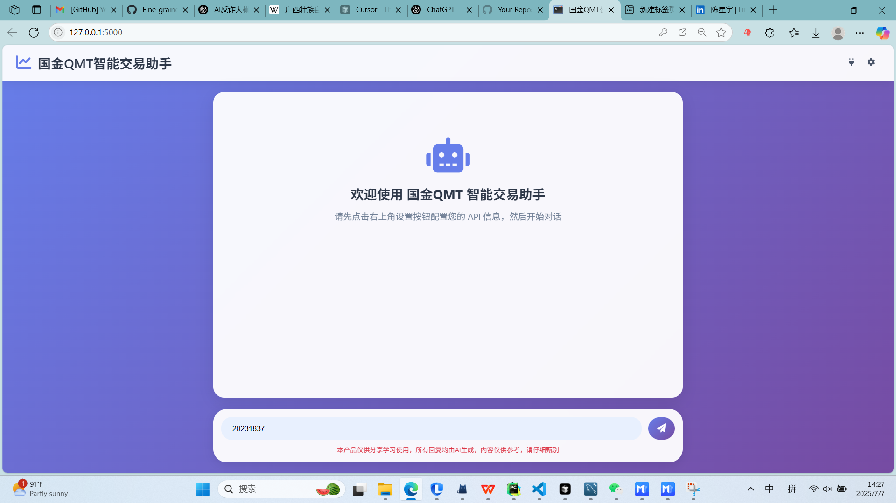

# QMT-MCP - 模块化量化交易助手

<div align="center">


一个基于FastMCP和XTQuant的模块化量化交易系统，提供智能策略生成、实时交易执行和回测分析功能。

</div>

## 🌟 项目特色

- **🔗 MCP协议集成**: 基于Model Context Protocol，与AI助手无缝连接
- **📈 智能策略生成**: 自动生成和优化量化交易策略
- **⚡ 实时交易执行**: 支持XTQuant/QMT实盘和模拟交易
- **🧠 模块化架构**: 清晰的代码结构，易于扩展和维护
- **📊 回测分析**: 完整的策略回测和绩效评估
- **🛡️ 风险控制**: 内置多层风险控制机制

## 🎬 演示视频

> 📺 点击封面图或链接即可在 Bilibili 观看完整演示
>
> https://www.bilibili.com/video/BV1SFGjz6EKN/?vd_source=26053b834f0ddd4f57b22169d74b6f78

<!-- 如果你准备了演示封面图，可以把下面这行的 docs/demo_cover.png 换成你的图片路径 -->
[](https://www.bilibili.com/video/BV1SFGjz6EKN/?vd_source=26053b834f0ddd4f57b22169d74b6f78)

## 🏗️ 系统架构

```
国金QMT-MCP/
├── main.py                 # FastMCP服务器主入口
├── config.json            # 系统配置文件
├── requirements.txt        # 项目依赖
├── src/
│   ├── config.py          # 配置管理模块（支持环境变量）
│   ├── tools/             # MCP工具实现
│   │   ├── trading_tool.py    # 交易执行工具
│   │   └── qmt_tool.py        # QMT策略工具
│   ├── strategies/        # 策略模块
│   │   ├── ma_strategy.py     # 双均线策略
│   │   └── strategy_generator.py # 策略生成器
│   └── utils/             # 工具模块
│       ├── xtquant_client.py  # XTQuant客户端
│       └── data_handler.py    # 数据处理器
└── logs/                  # 日志文件目录
```

## 🚀 快速开始

### 环境要求

- **Python 3.8+**
- **XTQuant/QMT客户端** (国金/迅投量化交易客户端)
- **Windows系统** (XTQuant仅支持Windows)

### 安装步骤

1. **克隆项目**
```bash
git clone <repository-url>
cd Nondescript-MCP
```

2. **安装依赖**
```bash
pip install -r requirements.txt
```

3. **配置环境**

创建 `.env` 文件并配置以下参数：

```env
# =====================================================
# 国金QMT-MCP 环境配置文件
# 请根据你的实际环境修改下面的配置参数
# =====================================================

# 服务器配置
QUANTMCP_HOST=127.0.0.1          # MCP服务器监听地址，通常保持127.0.0.1
QUANTMCP_PORT=8000               # MCP服务器端口号，可根据需要修改
QUANTMCP_TRANSPORT=sse           # 传输协议，保持sse即可

# XTQuant/QMT 交易客户端配置
# 重要：请修改为你的QMT安装路径和账户信息
QMT_PATH=你的QMT安装路径\userdata_mini        # QMT客户端数据目录，如: D:\QMT\userdata_mini
QMT_SESSION_ID=你的会话ID                      # QMT会话ID，整数，如: 12345
QMT_ACCOUNT_ID=你的交易账户ID                  # 你的模拟或实盘交易账户ID

# QMT策略保存目录
QMT_STRATEGY_DIR=你的QMT策略目录\mpython       # QMT策略文件保存目录，如: D:\QMT\mpython

# 交易风险控制配置
MAX_ORDER_VALUE=100000.0         # 单笔订单最大金额(元)，防止误操作大额下单
MAX_POSITION_VALUE=500000.0      # 单只股票最大持仓金额(元)，控制单股风险
MIN_ORDER_QUANTITY=100           # 最小下单数量(股)，通常为100的整数倍
MARKET_ORDER_SPREAD=0.1          # 市价单价差比例(0.1=10%)，避免成交价偏离过大

# 策略默认参数配置
DEFAULT_SYMBOL=000001.SZ         # 默认股票代码，用于测试和演示
DEFAULT_START_DATE=20240101      # 默认回测开始日期，格式YYYYMMDD
DEFAULT_END_DATE=20241201        # 默认回测结束日期，格式YYYYMMDD  
DEFAULT_SHORT_PERIOD=5           # 默认短期均线天数
DEFAULT_LONG_PERIOD=20           # 默认长期均线天数

# 日志配置
LOG_LEVEL=INFO                   # 日志级别: DEBUG/INFO/WARNING/ERROR
LOG_FILE=logs/quantmcp.log       # 日志文件路径
```

4. **启动XTQuant客户端**
- 打开国金QMT或迅投量化客户端
- 确保客户端已登录并连接

5. **启动国金QMT-MCP服务**
```bash
python main.py
```

服务启动后将在 `http://127.0.0.1:8000` 提供MCP服务。

## 🔧 功能介绍

### 交易工具

#### 下单功能
```python
# 通过MCP接口调用
place_order(
    symbol="000001.SZ",    # 股票代码
    quantity=100,          # 买入股数
    price=10.5,           # 下单价格
    direction="BUY"       # 交易方向
)
```

#### 撤单功能
```python
cancel_order(order_id="12345")  # 撤销指定订单
```

### 策略生成

#### 双均线策略
```python
generate_ma_strategy(
    symbol="000001.SZ",      # 目标股票
    short_period=5,          # 短期均线
    long_period=20,          # 长期均线
    strategy_name="my_ma"    # 策略名称
)
```

#### 自定义策略
```python
save_qmt_strategy(
    strategy_name="custom_strategy",
    code="""
    def init(context):
        # 策略初始化
        pass
    
    def handle_bar(context, bar_dict):
        # 策略执行逻辑
        pass
    """
)
```

## 📊 策略回测

系统提供完整的策略回测功能，包括：

- **收益指标**: 总收益率、年化收益率、夏普比率
- **风险指标**: 最大回撤、波动率、VaR
- **交易统计**: 交易次数、胜率、平均盈亏
- **绩效评估**: 策略评级和优化建议

### 回测报告示例

```
[OK] 双均线策略生成成功！

[DATA] 股票信息: 000001.SZ
[DATE] 数据期间: 20240101 至 20241201
[CHART] 数据条数: 242 条
[DATA] 交易天数: 242 天

[TARGET] 双均线策略参数:
   * 短期均线: 5日
   * 长期均线: 20日

[CHART] 策略表现:
   * 总收益率: 15.23%
   * 年化收益率: 18.45%
   * 最大回撤: -8.67%
   * 年化波动率: 22.15%
   * 夏普比率: 0.845
   * 交易次数: 24
   * 胜率: 58.33%

[TIP] 策略评价:
   [OK] 年化收益良好，超过15%
   [OK] 风险控制优秀，最大回撤小于10%
   [WARNING] 夏普比率一般，收益风险比有待提升
   [OK] 胜率良好，超过50%
```

## 🛡️ 风险控制

系统内置多层风险控制机制：

### 交易层面
- 单笔订单最大金额限制
- 单标的最大持仓限制
- 最小下单数量控制
- 市价单价差保护

### 策略层面
- 最大回撤限制
- 最小夏普比率要求
- 杠杆率控制
- 止损比例设置

### 系统层面
- 交易状态控制
- 连接状态监控
- 异常处理机制
- 日志记录追踪

## 🔌 MCP集成

国金QMT-MCP完全兼容Model Context Protocol，可以与支持MCP的AI助手集成：

### 首选：SSE 直连配置（推荐）
如果你只需要**直接连接**到已经启动的国金QMT-MCP服务器，最简洁可靠的方式就是使用 **SSE(Server-Sent Events) 直连**。

```json
{
  "mcpServers": {
    "qmt-mcp": {
      "type": "sse",
      "url": "http://127.0.0.1:8000/sse",
      "timeout": 60,
      "autoApprove": []
    }
  }
}
```
> 📌 **为何推荐 SSE？**
> - 🛠️ **零依赖**：客户端无需再执行 Python/Node 等命令。
> - ⚡ **即开即用**：服务器启动后即可被任何支持MCP的应用发现。
> - 🪶 **配置最少**：仅需 `type` 与 `url` 两个关键字段。
> - 🌐 **远程友好**：修改 `url` 即可在局域网/云服务器访问。

下面展示不同工具 (Claude Desktop / VS Code Cline / Cursor) 的完整配置示例，如果需要自动拉起服务器也可使用 `command/args` 模式。

### Claude Desktop集成
在Claude Desktop的配置文件中添加：

```json
{
  "mcpServers": {
    "quantmcp": {
      "command": "python",
      "args": ["path/to/Nondescript-MCP/main.py"],
      "env": {
        "QMT_PATH": "你的QMT安装路径\\userdata_mini"
      }
    }
  }
}
```

### 可用工具
- `place_order`: 执行股票交易
- `cancel_order`: 撤销订单
- `save_qmt_strategy`: 保存自定义策略
- `generate_ma_strategy`: 生成双均线策略

## 📋 配置说明

### 核心配置项

| 配置项 | 说明 | 默认值 |
|--------|------|--------|
| QMT_PATH | QMT客户端安装路径 | 你的QMT安装路径\userdata_mini |
| QMT_SESSION_ID | QMT会话ID | 你的会话ID |
| QMT_ACCOUNT_ID | 交易账户ID | 你的交易账户ID |
| MAX_ORDER_VALUE | 单笔订单最大金额 | 100000.0 |
| MAX_POSITION_VALUE | 单标的最大持仓 | 500000.0 |

### 策略配置项

| 配置项 | 说明 | 默认值 |
|--------|------|--------|
| DEFAULT_SYMBOL | 默认股票代码 | 000001.SZ |
| DEFAULT_SHORT_PERIOD | 默认短期均线 | 5 |
| DEFAULT_LONG_PERIOD | 默认长期均线 | 20 |

## 🧪 开发指南

### 添加新策略

1. 在 `src/strategies/` 目录下创建策略模块
2. 实现策略类，包含信号计算和回测方法
3. 在 `strategy_generator.py` 中注册新策略
4. 更新配置文件添加策略参数

### 添加新工具

1. 在 `src/tools/` 目录下创建工具模块
2. 实现工具类和相关方法
3. 在 `main.py` 中使用 `@mcp.tool()` 装饰器注册
4. 更新 `__init__.py` 文件导出新工具

### 测试

```bash
# 运行测试
pytest tests/

# 代码格式化
black src/

# 代码检查
flake8 src/
```

## 📚 API文档

### place_order(symbol, quantity, price, direction)
执行股票交易订单

**参数:**
- `symbol` (str): 股票代码，如 "000001.SZ"
- `quantity` (int): 交易数量，必须是100的整数倍
- `price` (float): 下单价格
- `direction` (str): 交易方向，"BUY" 或 "SELL"

**返回:**
- `str`: 下单结果信息

### generate_ma_strategy(symbol, short_period, long_period, strategy_name)
生成双均线策略

**参数:**
- `symbol` (str): 目标股票代码
- `short_period` (int): 短期均线周期
- `long_period` (int): 长期均线周期
- `strategy_name` (str, optional): 策略名称

**返回:**
- `str`: 策略生成和回测结果

## 🔍 常见问题

### Q: XTQuant连接失败怎么办？
A: 确保QMT客户端已启动并登录，检查 `QMT_PATH` 配置是否正确。

### Q: 如何修改风险控制参数？
A: 在 `.env` 文件中修改 `MAX_ORDER_VALUE`、`MAX_POSITION_VALUE` 等参数。

### Q: 策略回测数据不准确？
A: 检查数据日期范围，确保XTQuant有相应的历史数据权限。

### Q: 如何添加新的技术指标？
A: 在 `src/strategies/` 目录下创建新的策略模块，参考 `ma_strategy.py` 的实现。

## 📄 许可证

本项目采用 MIT 许可证 - 详见 [LICENSE](LICENSE) 文件

## 🤝 贡献

欢迎提交Issue和Pull Request来改进项目！

## 📞 联系方式

- 项目地址: https://github.com/guangxiangdebizi/QMT-MCP
- 问题反馈: https://github.com/guangxiangdebizi/QMT-MCP/issues
- 文档: https://github.com/guangxiangdebizi/QMT-MCP/wiki
- 邮箱: guangxiangdebizi@gmail.com
- LinkedIn: https://www.linkedin.com/in/%E6%98%9F%E5%AE%87-%E9%99%88-b5b3b0313/

---

<div align="center">

**🌟 如果这个项目对你有帮助，请给个Star支持一下！ 🌟**

</div> 
